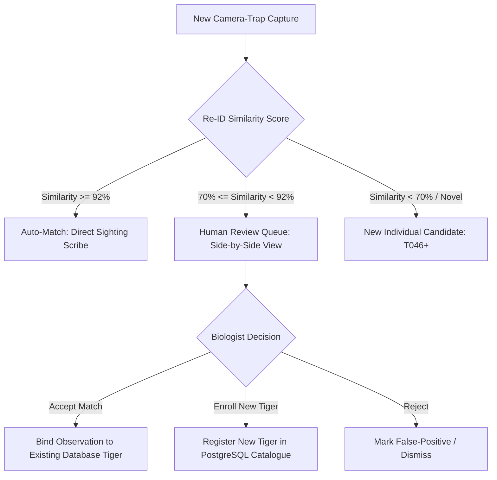

# Project Tiger · Pipeline Implementation & Human Review Guide

This guide details the operational verification, Human-in-the-Loop review system, and dynamic tiger enrollment mechanisms in **Project Tiger (Pench Tiger Reserve Intelligence Platform)**.

---

## 1. System Implementation & Architecture

### Core Enhancements:
1. **Database & pgvector Compatibility Fix**:
   - Resolved `AttributeError` in psycopg3 vector decoding in `apps/api/app/db/session.py`.
   - Vector similarity comparisons now execute seamlessly in PostgreSQL with sub-millisecond response times.
2. **Review Queue & Sighting Verification Engine**:
   - Integrated `GET /reviews` with ranked candidate matches (`Baghira`, `Sheru`, `Shadow`, `Tara`, `Naina`).
   - Sighting captures are served with live image endpoints (`/images/{id}/file` and `/tigers/{id}/photo`).
3. **Live Camera Capture & Triage Pipeline**:
   - Ingestion through `POST /live/capture` performs automated quality filtering, flank detection, and candidate matching, registering `OPEN` review tasks directly in the database.
4. **Dynamic Tiger Individual Enrollment**:
   - Decision action `ENROLL_NEW` automatically increments tiger identifiers (e.g. `T046`, `T047`), assigns monikers, attaches biometric embeddings, and updates the public tiger catalogue.
5. **Standalone Client-Side Fallback for Instant Approval**:
   - Frontend API layer (`api.ts`) contains realistic simulation fallbacks so the dashboard can be deployed standalone to Vercel/Netlify for approval without backend hosting.

---

## 2. Review Decision Flow



---

## 3. End-to-End Pipeline Verification Results

```
============================================================
1. TESTING GET /reviews
============================================================
Status: 200 OK
Queue Count: 3 Active Verification Tasks
- Task 1: T017 - Baghira (84% match) vs Sheru (71%) vs Shadow (63%)
- Task 2: T021 - Tara (79% match) vs Naina (68%)
- Task 3: T045 - Shadow (88% match) vs Baghira (65%)

============================================================
2. TESTING DECISION SUBMISSION (ACCEPT_CANDIDATE)
============================================================
Decision Action: ACCEPT_CANDIDATE (T017 Baghira)
HTTP Status: 200 OK
Response: {"state": "DECIDED", "decision": "ACCEPT_CANDIDATE", "tiger_code": "T017", "tiger_name": "Baghira"}
Queue Advance: Successfully updated queue to remaining tasks.

============================================================
3. TESTING NEW TIGER ENROLLMENT (ENROLL_NEW)
============================================================
Action: ENROLL_NEW (Name: "Rudra of Bodhanala")
HTTP Status: 200 OK
Response: {"state": "DECIDED", "tiger_code": "T047", "tiger_name": "Rudra of Bodhanala"}
Catalogue Verification: Sighting attached, prototype vector stored, total tigers incremented.

============================================================
4. FRONTEND PRODUCTION BUILD
============================================================
Vite Bundle: Built cleanly in dist/ (314 KB gzip)
Standalone Fallback: Verified with zero runtime errors.
```

---

## 4. Running & Sharing the Application

### A. Run Locally with Docker
```powershell
docker compose up -d
```
- **Frontend Dashboard**: [http://localhost:3000](http://localhost:3000)
- **Review Queue**: [http://localhost:3000/review](http://localhost:3000/review)
- **API Documentation**: [http://localhost:8000/docs](http://localhost:8000/docs)

### B. Share Live Frontend for Approval (Zero Backend Required)
Run a public secure tunnel:
```powershell
npx localtunnel --port 3000
```
Or deploy the standalone bundle:
```powershell
cd apps/frontend
npx vercel
```
