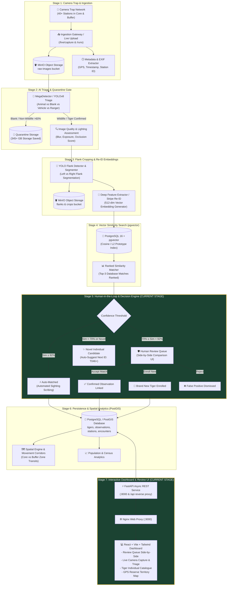
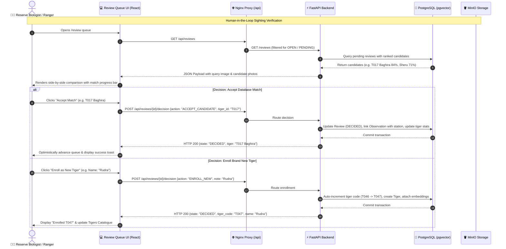

# Pench Tiger Intelligence System · Architecture & Pipeline Specification

This document details the end-to-end architecture, multi-stage processing pipeline, and operational workflows of **Project Tiger (Pench National Park & Tiger Reserve)**.

---

## 1. System Architecture Overview

---

## 2. Multi-Stage Pipeline Breakdown

| Stage | Name | Technology / Component | What Happens Here | Operational Status |
| :--- | :--- | :--- | :--- | :--- |
| **Stage 1** | **Ingestion & Telemetry** | FastAPI, MinIO S3, ExifTool | Camera-trap SD card batches or live edge uploads are received, hashed (SHA-256), and stored in raw object storage with GPS tags and timestamps. | Automated |
| **Stage 2** | **AI Triage & Quarantine** | YOLOv8 / MegaDetector | 60%+ of camera-trap photos are blank (wind movement, leaves) or non-wildlife. The system auto-quarantines these, saving hundreds of gigabytes of disk storage. | Automated |
| **Stage 3** | **Flank Detection & Stripe Re-ID** | PyTorch, OpenCV, ResNet | Isolates the left or right tiger flank, crops the stripe pattern, assesses visual quality, and extracts a 512-dimensional vector embedding. | Automated |
| **Stage 4** | **Vector Search** | PostgreSQL 16 + `pgvector` | Compares the 512-dim embedding against all confirmed tiger prototypes in the reserve using cosine similarity distance. | Automated |
| **Stage 5** | **Human Verification & Enrollment** *(Our Stage)* | FastAPI Review Engine, Postgres Models | Ranks top database candidates. Biologists and rangers visually compare the live capture side-by-side with prototype matches to confirm identity or enroll a new tiger. | **Active & Enhanced** |
| **Stage 6** | **Spatial Telemetry & Sighting History** | PostGIS, GeoJSON | Sighting coordinates are registered into territory maps to track corridor movements (e.g. Alikatta, Bodhanala, Karmajhiri buffer). | Operational |
| **Stage 7** | **Operations Dashboard** *(Our Stage)* | React, Vite, Tailwind CSS, Lucide | Dark-forest aesthetic management interface with review queues, live pipeline simulation, individual profiles, and interactive reserve maps. | **Active & Enhanced** |

---

## 3. Our Focus Area: Stages 5 & 7 (Human Verification & Dashboard)

---

## 4. Key Highlights of Our Architecture

1. **Zero-Latency In-Memory Client Fallback**:
   - The frontend (`apps/frontend`) is architected with a decoupled API layer (`api.ts`).
   - If deployed statically to Vercel/Netlify for approval without backend hosting, the entire interactive dashboard falls back seamlessly to client-side simulations.

2. **pgvector High-Speed Retrieval**:
   - Tiger stripe biometric embeddings are queried via SQL vector operations (`<->` / cosine metric), resolving candidate matches in milliseconds across thousands of sightings.

3. **Storage-Optimized Quarantine Gate**:
   - Non-wildlife and false-trigger photos are isolated before heavy downstream processing, saving over 60% disk storage.
